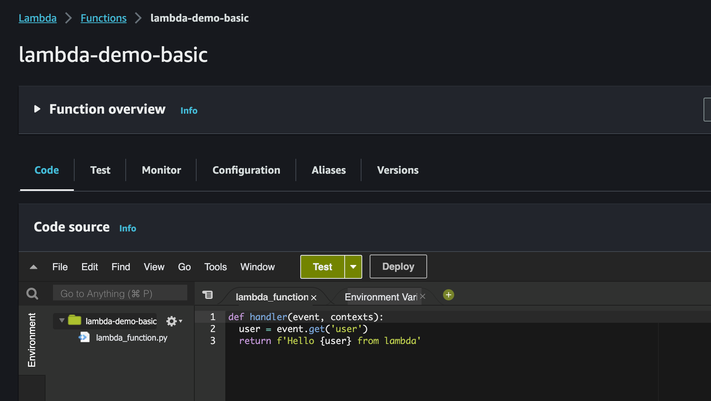
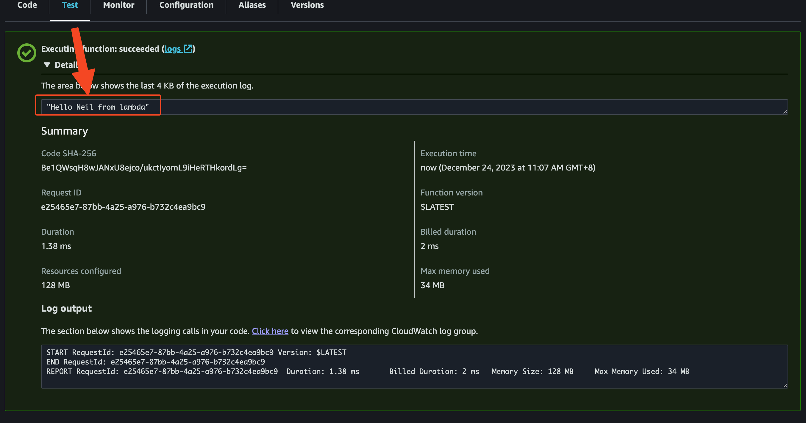
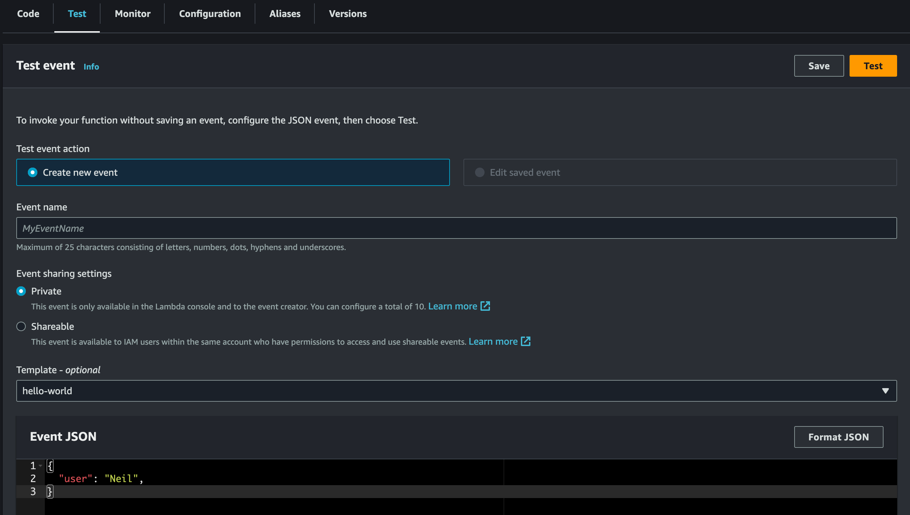

## Deploy to lambda Function

### package `lambda_function.py` to zip.
```bash
zip -j my_deployment_package_v1.zip v1/lambda_function.py
```

### check file in `my_deployment_package_v1.zip`.
```
unzip -l my_deployment_package_v1.zip 
Archive:  my_deployment_package_v1.zip
  Length      Date    Time    Name
---------  ---------- -----   ----
       93  12-24-2023 09:27   lambda_function.py
---------                     -------
       93                     1 file
```

### Create Iam role for Lambda Function.
```bash
export LAMBDA_IAM_ROLE="lambda-demo-role"

aws iam create-role --role-name $LAMBDA_IAM_ROLE \
--assume-role-policy-document \
'{
  "Version": "2012-10-17",
  "Statement": [
    {
      "Effect": "Allow",
      "Principal": {
        "Service": "lambda.amazonaws.com"
      },
      "Action": "sts:AssumeRole"
    }
  ]
}'


--- example output ---
{
    "Role": {
        "Path": "/",
        "RoleName": "lambda-demo-role",
        "RoleId": "AROA3YGNZNEMIIDIX4EOD",
        "Arn": "arn:aws:iam::012345678912:role/lambda-demo-role",
        "CreateDate": "2023-12-24T01:36:54+00:00",
        "AssumeRolePolicyDocument": {
            "Version": "2012-10-17",
            "Statement": [
                {
                    "Effect": "Allow",
                    "Principal": {
                        "Service": "lambda.amazonaws.com"
                    },
                    "Action": "sts:AssumeRole"
                }
            ]
        }
    }
}
--- end ---
```

### Attached Iam policy ``
```bash
aws iam attach-role-policy --role-name $LAMBDA_IAM_ROLE --policy-arn arn:aws:iam::aws:policy/service-role/AWSLambdaBasicExecutionRole
```

### Create Lambda Function (python runtime)and deploy.
> `--handler` 的地方要注意她應該填寫的是
> lambda_function.py 的名字 `lambda_function`
> lambda_function.py 內要被呼叫的 function name `def: handler(event, contexts):`...
```bash
export LAMBDA_FUNCTION_NAME="lambda-demo-basic"
export AWS_REGION="ap-northeast-1"
export LAMBDA_IAM_ROLE="lambda-demo-role"
export AWS_ACCOUNT=$(aws sts get-caller-identity --query 'Account' --output text)

aws lambda create-function --function-name ${LAMBDA_FUNCTION_NAME} \
--runtime python3.12 --handler lambda_function.handler \
--role arn:aws:iam::${AWS_ACCOUNT}:role/${LAMBDA_IAM_ROLE} \
--zip-file fileb://my_deployment_package_v1.zip


--- example output ---
{
    "FunctionName": "lambda-demo-basic",
    "FunctionArn": "arn:aws:lambda:ap-northeast-1:012345678912:function:lambda-demo-basic",
    "Runtime": "python3.12",
    "Role": "arn:aws:iam::012345678912:role/lambda-demo-role",
    "Handler": "lambda_function.handler",
    "CodeSize": 269,
    "Description": "",
    "Timeout": 3,
    "MemorySize": 128,
    "LastModified": "2023-12-24T01:46:46.866+0000",
    "CodeSha256": "Be1QWsqH8wJANxU8ejco/ukctIyomL9iHeRTHkordLg=",
    "Version": "$LATEST",
    "TracingConfig": {
        "Mode": "PassThrough"
    },
    "RevisionId": "49095394-7511-419b-80e6-183a55f034d5",
    "State": "Pending",
    "StateReason": "The function is being created.",
    "StateReasonCode": "Creating",
    "PackageType": "Zip",
    "Architectures": [
        "x86_64"
    ],
    "EphemeralStorage": {
        "Size": 512
    },
    "SnapStart": {
        "ApplyOn": "None",
        "OptimizationStatus": "Off"
    },
    "RuntimeVersionConfig": {
        "RuntimeVersionArn": "arn:aws:lambda:ap-northeast-1::runtime:c9875014cbcc77e3455765804516f064d18fe7b27ae7bdb2b1d84ab01ba784f5"
    }
}
--- end ---
```








### Test invoke Lambda Function
```bash
aws lambda invoke \
    --function-name ${LAMBDA_FUNCTION_NAME} \
    --cli-binary-format raw-in-base64-out \
    --payload '{ "user": "Bob" }' \
    response.json && cat response.json

--- example output ---
{
    "StatusCode": 200,
    "ExecutedVersion": "$LATEST"
}
"Hello Bob from lambda"%     
--- end ---
```


### Upgrade new code to Lambda
#### package v2 code
```bash
zip -j my_deployment_package_v2.zip v2/lambda_function.py


unzip -l my_deployment_package_v2.zip


--- example output ---
Archive:  my_deployment_package_v2.zip
  Length      Date    Time    Name
---------  ---------- -----   ----
      119  12-24-2023 09:53   lambda_function.py
---------                     -------
      119                     1 file
--- end ---
```

#### Update Lambda Function
```bash
export LAMBDA_FUNCTION_NAME="lambda-demo-basic"

aws lambda update-function-code --function-name ${LAMBDA_FUNCTION_NAME} \
--zip-file fileb://my_deployment_package_v2.zip


--- example output --- 
{
    "FunctionName": "lambda-demo-basic",
    "FunctionArn": "arn:aws:lambda:ap-northeast-1:012345678912:function:lambda-demo-basic",
    "Runtime": "python3.12",
    "Role": "arn:aws:iam::012345678912:role/lambda-demo-role",
    "Handler": "lambda_function.handler",
    "CodeSize": 288,
    "Description": "",
    "Timeout": 3,
    "MemorySize": 128,
    "LastModified": "2023-12-24T03:19:03.000+0000",
    "CodeSha256": "FtRkBomfvkmLqd6GDUzSVjf3KxIm8uA7PIg/6/g5VX0=",
    "Version": "$LATEST",
    "TracingConfig": {
        "Mode": "PassThrough"
    },
    "RevisionId": "2e4fb044-7e00-48a9-beab-c444f699b040",
    "State": "Active",
    "LastUpdateStatus": "InProgress",
    "LastUpdateStatusReason": "The function is being created.",
    "LastUpdateStatusReasonCode": "Creating",
    "PackageType": "Zip",
    "Architectures": [
        "x86_64"
    ],
    "EphemeralStorage": {
        "Size": 512
    },
    "SnapStart": {
        "ApplyOn": "None",
        "OptimizationStatus": "Off"
    },
    "RuntimeVersionConfig": {
        "RuntimeVersionArn": "arn:aws:lambda:ap-northeast-1::runtime:c9875014cbcc77e3455765804516f064d18fe7b27ae7bdb2b1d84ab01ba784f5"
    }
}
--- end ---
```

### Test invoke Lambda Function v2
```bash
aws lambda invoke \
    --function-name ${LAMBDA_FUNCTION_NAME} \
    --cli-binary-format raw-in-base64-out \
    --payload '{ "user": "Bob" }' \
    response.json && cat response.json

--- example output ---
{
    "StatusCode": 200,
    "ExecutedVersion": "$LATEST"
}
"Hello Bob from lambda v2~~"%     
--- end ---
```


### Clean up
```bash
export LAMBDA_FUNCTION_NAME="lambda-demo-basic"
export AWS_REGION="ap-northeast-1"
export LAMBDA_IAM_ROLE="lambda-demo-role"
export AWS_ACCOUNT=$(aws sts get-caller-identity --query 'Account' --output text)

aws lambda delete-function --function-name ${LAMBDA_FUNCTION_NAME} --region ${AWS_REGION}

aws logs delete-log-group --log-group-name "/aws/lambda/${LAMBDA_FUNCTION_NAME}" --region ${AWS_REGION}

aws iam list-attached-role-policies --role-name ${LAMBDA_IAM_ROLE} --query="AttachedPolicies[].PolicyArn" --output text | xargs -n1 aws iam detach-role-policy --role-name ${LAMBDA_IAM_ROLE} --policy-arn

aws iam delete-role --role-name ${LAMBDA_IAM_ROLE}
```