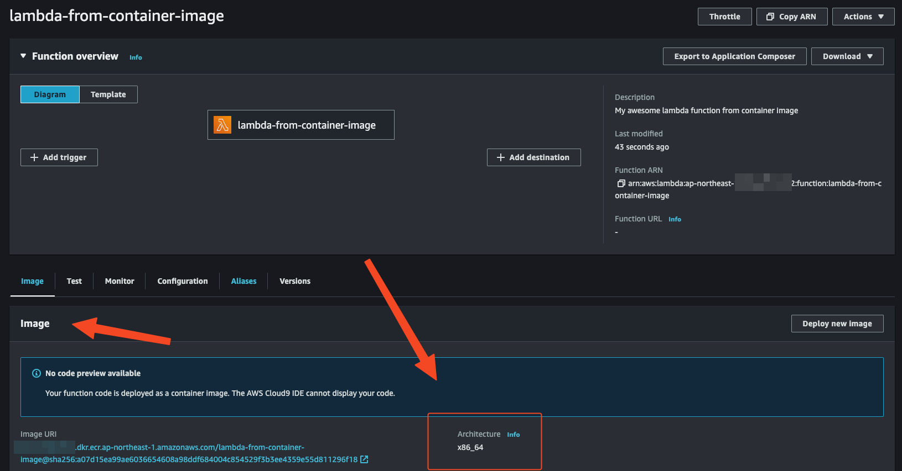

## Prerequire
- [aws cli](https://docs.aws.amazon.com/cli/latest/userguide/getting-started-install.html)
- [terraform cli](https://developer.hashicorp.com/terraform/tutorials/aws-get-started/install-cli)
- container runtime:
  - [Orbstack (Mac)](https://orbstack.dev/download)
  - [Docker Desktop](https://docs.docker.com/desktop/)
  - [Finch (Mac)](https://github.com/runfinch/finch/releases)
  - [podman](https://podman.io/docs/installation)
  - etc...

## Terraform Init
```
terraform init -upgrade

Initializing the backend...
Upgrading modules...
Downloading registry.terraform.io/terraform-aws-modules/lambda/aws 6.5.0 for docker_image...
- docker_image in .terraform/modules/docker_image/modules/docker-build
Downloading registry.terraform.io/terraform-aws-modules/lambda/aws 6.5.0 for lambda_function_from_container_image...
- lambda_function_from_container_image in .terraform/modules/lambda_function_from_container_image

Initializing provider plugins...
- Finding kreuzwerker/docker versions matching ">= 3.0.0, ~> 3.0.2"...
- Finding hashicorp/null versions matching ">= 2.0.0"...
- Finding hashicorp/external versions matching ">= 1.0.0"...
- Finding hashicorp/local versions matching ">= 1.0.0"...
- Finding hashicorp/aws versions matching "~> 4.0, >= 4.22.0, >= 4.63.0"...
- Installing hashicorp/external v2.3.2...
- Installed hashicorp/external v2.3.2 (signed by HashiCorp)
- Installing hashicorp/local v2.4.1...
- Installed hashicorp/local v2.4.1 (signed by HashiCorp)
- Installing hashicorp/aws v4.67.0...
- Installed hashicorp/aws v4.67.0 (signed by HashiCorp)
- Installing kreuzwerker/docker v3.0.2...
- Installed kreuzwerker/docker v3.0.2 (self-signed, key ID BD080C4571C6104C)
- Installing hashicorp/null v3.2.2...
- Installed hashicorp/null v3.2.2 (signed by HashiCorp)

Partner and community providers are signed by their developers.
If you'd like to know more about provider signing, you can read about it here:
https://www.terraform.io/docs/cli/plugins/signing.html

Terraform has created a lock file .terraform.lock.hcl to record the provider
selections it made above. Include this file in your version control repository
so that Terraform can guarantee to make the same selections by default when
you run "terraform init" in the future.

Terraform has been successfully initialized!

You may now begin working with Terraform. Try running "terraform plan" to see
any changes that are required for your infrastructure. All Terraform commands
should now work.

If you ever set or change modules or backend configuration for Terraform,
rerun this command to reinitialize your working directory. If you forget, other
commands will detect it and remind you to do so if necessary.

```


### Terraform vars check
- `docker_host`: check with `docker context list`, I will pick orbstack "unix:///Users/neilkuan/.orbstack/run/docker.sock"
```bash
docker context list 

NAME            DESCRIPTION                               DOCKER ENDPOINT                                    ERROR
default         Current DOCKER_HOST based                 unix:///var/run/docker.sock                        
desktop-linux                                             unix:///Users/neilkuan/.docker/run/docker.sock     
orbstack *      OrbStack                                  unix:///Users/neilkuan/.orbstack/run/docker.sock
```


### Terraform plan 
```bash
export DOCKER_HOST="REPLACE_TO_YOUR_DOCKER_HOST"
terraform plan -var="docker_host=${DOCKER_HOST}"

--- example output ---
module.docker_image.data.aws_caller_identity.this: Reading...
data.aws_region.current: Reading...
module.lambda_function_from_container_image.data.aws_caller_identity.current: Reading...
data.aws_ecr_authorization_token.token: Reading...
module.lambda_function_from_container_image.data.aws_partition.current: Reading...
module.docker_image.data.aws_region.current: Reading...
data.aws_caller_identity.this: Reading...
module.lambda_function_from_container_image.data.aws_iam_policy_document.assume_role[0]: Reading...
data.aws_region.current: Read complete after 0s [id=ap-northeast-1]
module.lambda_function_from_container_image.data.aws_partition.current: Read complete after 0s [id=aws]
module.lambda_function_from_container_image.data.aws_region.current: Reading...
module.docker_image.data.aws_region.current: Read complete after 0s [id=ap-northeast-1]
module.lambda_function_from_container_image.data.aws_region.current: Read complete after 0s [id=ap-northeast-1]
module.lambda_function_from_container_image.data.aws_iam_policy_document.assume_role[0]: Read complete after 0s [id=3693445097]
data.aws_ecr_authorization_token.token: Read complete after 0s [id=ap-northeast-1]
module.docker_image.data.aws_caller_identity.this: Read complete after 0s [id=012345678912]
data.aws_caller_identity.this: Read complete after 0s [id=012345678912]
module.lambda_function_from_container_image.data.aws_caller_identity.current: Read complete after 0s [id=012345678912]

Terraform used the selected providers to generate the following execution plan. Resource actions are indicated with the following symbols:
  + create
 <= read (data resources)

Terraform will perform the following actions:

  # module.docker_image.aws_ecr_repository.this[0] will be created
  + resource "aws_ecr_repository" "this" {
      + arn                  = (known after apply)
      + force_delete         = true
      + id                   = (known after apply)
      + image_tag_mutability = "MUTABLE"
      + name                 = "lambda-from-container-image"
      + registry_id          = (known after apply)
      + repository_url       = (known after apply)
      + tags_all             = (known after apply)

      + image_scanning_configuration {
          + scan_on_push = false
        }
    }

  # module.docker_image.docker_image.this will be created
  + resource "docker_image" "this" {
      + force_remove = false
      + id           = (known after apply)
      + image_id     = (known after apply)
      + keep_locally = false
      + name         = (known after apply)
      + repo_digest  = (known after apply)
      + triggers     = {
          + "dir_sha" = "da39a3ee5e6b4b0d3255bfef95601890afd80709"
        }

      + build {
          + cache_from   = []
          + context      = "lambda-container"
          + dockerfile   = "Dockerfile"
          + extra_hosts  = []
          + platform     = "linux/amd64"
          + remove       = true
          + security_opt = []
          + tag          = []
        }
    }

  # module.docker_image.docker_registry_image.this will be created
  + resource "docker_registry_image" "this" {
      + id                   = (known after apply)
      + insecure_skip_verify = false
      + keep_remotely        = false
      + name                 = (known after apply)
      + sha256_digest        = (known after apply)
      + triggers             = (known after apply)
    }

  # module.lambda_function_from_container_image.data.aws_iam_policy_document.logs[0] will be read during apply
  # (config refers to values not yet known)
 <= data "aws_iam_policy_document" "logs" {
      + id   = (known after apply)
      + json = (known after apply)

      + statement {
          + actions   = [
              + "logs:CreateLogGroup",
              + "logs:CreateLogStream",
              + "logs:PutLogEvents",
            ]
          + effect    = "Allow"
          + resources = (known after apply)
        }
    }

  # module.lambda_function_from_container_image.aws_cloudwatch_log_group.lambda[0] will be created
  + resource "aws_cloudwatch_log_group" "lambda" {
      + arn               = (known after apply)
      + id                = (known after apply)
      + name              = "/aws/lambda/lambda-from-container-image"
      + name_prefix       = (known after apply)
      + retention_in_days = 0
      + skip_destroy      = false
      + tags_all          = (known after apply)
    }

  # module.lambda_function_from_container_image.aws_iam_policy.logs[0] will be created
  + resource "aws_iam_policy" "logs" {
      + arn         = (known after apply)
      + id          = (known after apply)
      + name        = "lambda-from-container-image-logs"
      + name_prefix = (known after apply)
      + path        = "/"
      + policy      = (known after apply)
      + policy_id   = (known after apply)
      + tags_all    = (known after apply)
    }

  # module.lambda_function_from_container_image.aws_iam_role.lambda[0] will be created
  + resource "aws_iam_role" "lambda" {
      + arn                   = (known after apply)
      + assume_role_policy    = jsonencode(
            {
              + Statement = [
                  + {
                      + Action    = "sts:AssumeRole"
                      + Effect    = "Allow"
                      + Principal = {
                          + Service = "lambda.amazonaws.com"
                        }
                      + Sid       = ""
                    },
                ]
              + Version   = "2012-10-17"
            }
        )
      + create_date           = (known after apply)
      + force_detach_policies = true
      + id                    = (known after apply)
      + managed_policy_arns   = (known after apply)
      + max_session_duration  = 3600
      + name                  = "lambda-from-container-image"
      + name_prefix           = (known after apply)
      + path                  = "/"
      + role_last_used        = (known after apply)
      + tags_all              = (known after apply)
      + unique_id             = (known after apply)
    }

  # module.lambda_function_from_container_image.aws_iam_role_policy_attachment.logs[0] will be created
  + resource "aws_iam_role_policy_attachment" "logs" {
      + id         = (known after apply)
      + policy_arn = (known after apply)
      + role       = "lambda-from-container-image"
    }

  # module.lambda_function_from_container_image.aws_lambda_function.this[0] will be created
  + resource "aws_lambda_function" "this" {
      + architectures                  = [
          + "arm64",
        ]
      + arn                            = (known after apply)
      + description                    = "My awesome lambda function from container image"
      + function_name                  = "lambda-from-container-image"
      + id                             = (known after apply)
      + image_uri                      = (known after apply)
      + invoke_arn                     = (known after apply)
      + last_modified                  = (known after apply)
      + memory_size                    = 128
      + package_type                   = "Image"
      + publish                        = false
      + qualified_arn                  = (known after apply)
      + qualified_invoke_arn           = (known after apply)
      + reserved_concurrent_executions = -1
      + role                           = (known after apply)
      + signing_job_arn                = (known after apply)
      + signing_profile_version_arn    = (known after apply)
      + skip_destroy                   = false
      + source_code_hash               = (known after apply)
      + source_code_size               = (known after apply)
      + tags_all                       = (known after apply)
      + timeout                        = 3
      + version                        = (known after apply)

      + ephemeral_storage {
          + size = 512
        }

      + timeouts {}
    }

Plan: 8 to add, 0 to change, 0 to destroy.

--- end ---
```


### Terraform apply (Deploy resource)
```bash
export DOCKER_HOST="REPLACE_TO_YOUR_DOCKER_HOST"
terraform apply -var="docker_host=${DOCKER_HOST}" -auto-approve

--- example output ---
module.docker_image.docker_image.this: Creating...
module.docker_image.docker_image.this: Still creating... [10s elapsed]
module.docker_image.docker_image.this: Still creating... [20s elapsed]
module.docker_image.docker_image.this: Still creating... [30s elapsed]
module.docker_image.docker_image.this: Still creating... [40s elapsed]
module.docker_image.docker_image.this: Still creating... [50s elapsed]
module.docker_image.docker_image.this: Creation complete after 58s [id=sha256:445262e58cab94786a8a7ca4fc519b9f33a10432ce9fbd51dae98e21384694b7807885433112.dkr.ecr.ap-northeast-1.amazonaws.com/lambda-from-container-image]
module.docker_image.docker_registry_image.this: Creating...
module.docker_image.docker_registry_image.this: Still creating... [10s elapsed]
module.docker_image.docker_registry_image.this: Still creating... [20s elapsed]
module.docker_image.docker_registry_image.this: Still creating... [30s elapsed]
module.docker_image.docker_registry_image.this: Still creating... [40s elapsed]
module.docker_image.docker_registry_image.this: Still creating... [50s elapsed
module.docker_image.docker_registry_image.this: Creation complete after 53s [id=sha256:a07d15ea99ae6036654608a98ddf684004c854529f3b3ee4359e55d811296f18]
module.lambda_function_from_container_image.aws_lambda_function.this[0]: Creating...
module.lambda_function_from_container_image.aws_lambda_function.this[0]: Still creating... [11s elapsed]
module.lambda_function_from_container_image.aws_lambda_function.this[0]: Still creating... [11s elapsed]
module.lambda_function_from_container_image.aws_lambda_function.this[0]: Still creating... [21s elapsed]
module.lambda_function_from_container_image.aws_lambda_function.this[0]: Creation complete after 30s [id=lambda-from-container-image]

Apply complete! Resources: 3 added, 0 changed, 0 destroyed.
--- end ---
```

### Lambda console check



### Lambda console test


### Clean up
```bash
terraform destroy -auto-approve -var="docker_host=${DOCKER_HOST}"
```